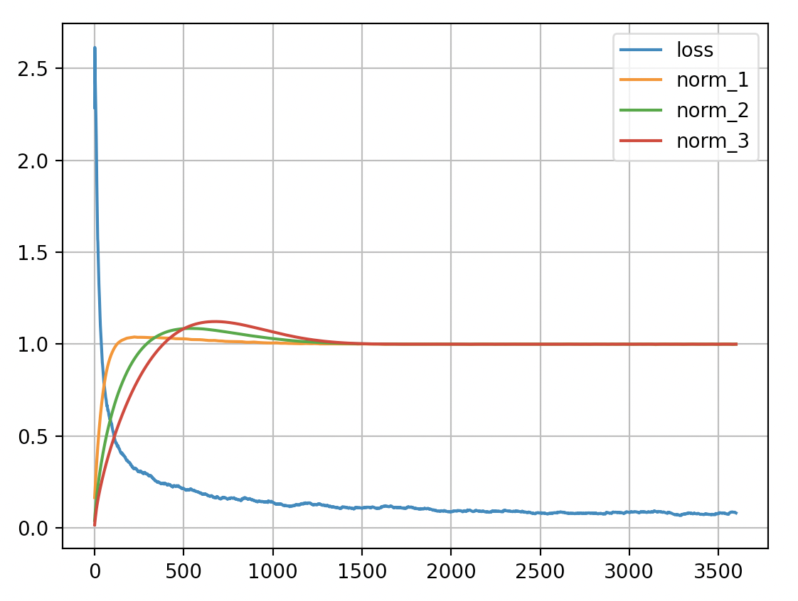

# mdmm

`mdmm` implements the Modified Differential Multiplier Method for PyTorch. It was proposed in Platt and Barr (1988), "[Constrained Differential Optimization](https://papers.nips.cc/paper/1987/file/a87ff679a2f3e71d9181a67b7542122c-Paper.pdf)". The MDMM minimizes a primary loss function subject to equality, inequality, and bound constraints on arbitrarily many secondary functions of your problem's parameters. It can be used for non-convex problems and problems with stochastic loss functions. It requires only one evaluation of the Lagrangian and its gradient per iteration, the same complexity as SGD.

Here is a plot of the training loss and layer norms of `mdmm_demo_mnist.py`. Each of its three layers has an equality constraint that the mean absolute value of its weights be 1:



## Basic usage

Creating a constraint instance, an `MDMM` instance, and the optimizer for the Lagrangian:

```python
import mdmm

constraint = mdmm.EqConstraint(fn_of_params, 1)
mdmm_module = mdmm.MDMM([constraint])
opt = mdmm_module.make_optimizer(model.parameters(), lr=2e-3)
```

MDMM constraints introduce extra parameters (Lagrange multipliers and slack variables) which must be included in the optimizer. Each `MaxConstraint` and `MinConstraint` introduces two parameters each, while all of the other constraint types introduce one. `make_optimizer()` accepts an optional optimizer factory keyword argument, `optimizer`, which can be set to a `torch.optim` class; use `functools.partial()` on the class to set the optimizer's arguments to non-default values. The default optimizer type is Adamax.

Inside your training loop, do:

```python
outputs = model(inputs)
loss = loss_fn(outputs, targets)
mdmm_return = mdmm_module(loss)
opt.zero_grad()
mdmm_return.value.backward()
opt.step()
```

When an `MDMM` instance is called with the value of the primary loss function, it evaluates the functions originally passed to the constraints' constructors and returns a type containing a value augmented with terms involving the constraint functions. Calling `backward()` on this value will propagate gradients into your parameters and the parameters internal to the constraints. The type `MDMM` returns also contains a list of the constraint function values and a list of the computed infeasibilities (equal to 0 when the constraint is satisfied).

Since the constraints contain parameters internal to them, you must save and load the state dict of the `MDMM` instance (this contains all of the constraint buffers and parameters in the correct order) as well as the model and optimizer state dicts in order to be able to resume training from a checkpoint.
